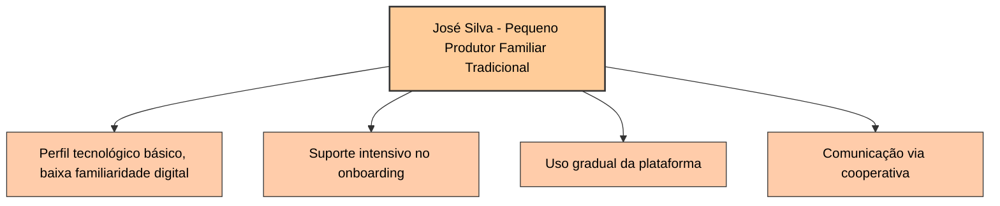

# Diagrama de Função - Persona 1: José Silva - Pequeno Produtor Familiar Tradicional

## Funcionalidades mais importantes para José Silva

1. **Suporte intensivo no onboarding**
   Fundamental para ajudar José Silva a se familiarizar com a plataforma, considerando seu perfil tecnológico básico e baixa familiaridade digital. Um onboarding assistido e simplificado garante que ele consiga usar o sistema sem frustrações.
2. **Uso gradual da plataforma**
   Permite que José avance no uso das funcionalidades conforme ganha confiança, evitando sobrecarga e facilitando a adaptação ao sistema.
3. **Comunicação via cooperativa**
   Facilita o suporte e a troca de informações, aproveitando a estrutura da cooperativa para manter José informado e assistido, compensando sua baixa familiaridade digital.
4. **Funcionalidades básicas e essenciais para o pequeno produtor**
   Conforme detalhado nos documentos do projeto, as funcionalidades básicas e essenciais para José Silva incluem:

   - Controle financeiro simplificado para facilitar a gestão das finanças. [ver a possibilidade de agregar esse módulo para garantir informações]
   - Acompanhamento de safra para monitorar a produção e planejar vendas. [verificar a possibilidade de acompanhamentoe monitoramento, tendo informações nós podemos fornecer, pesquisa para capturar informações]
   - Suporte direto e acessível para dúvidas e problemas operacionais. [Suporte ao produtor, humano] [Faq, Envio chamado, email] [ChatBot]
   - Onboarding assistido para garantir o uso correto da plataforma. [Saas, Trabalhar com a perspectiva para fazer o usuário procurar como resolver seus problemas]
   - Comunicação integrada via cooperativa para facilitar o acesso a informações e suporte.
   - Exportação de relatórios simples para acompanhamento e prestação de contas.
   - Alertas climáticos simplificados para auxiliar no planejamento agrícola.
   - Uso de tecnologias acessíveis, como QR-Code para rastreabilidade básica.

Essas funcionalidades são as que trarão mais valor para José Silva em um sistema como o Global Coffee, garantindo sua inclusão digital e facilitando sua jornada como produtor familiar tradicional.
