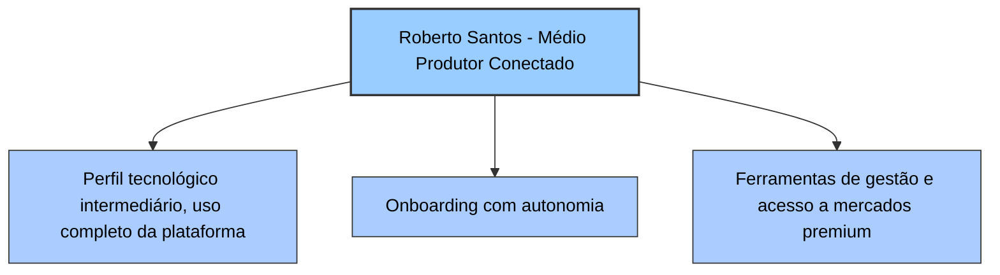

# Diagrama de Função - Persona 2: Roberto Santos - Médio Produtor Conectado

## Funcionalidades mais importantes para Roberto Santos

1. **Onboarding com autonomia**
   Permite que Roberto utilize a plataforma de forma independente, refletindo seu perfil tecnológico intermediário e maior familiaridade digital.
2. **Ferramentas de gestão avançadas**
   Incluem funcionalidades específicas que ajudam Roberto Santos a otimizar suas operações agrícolas e comerciais, detalhadas a seguir:

   - **Controle financeiro detalhado:** Permite o gerenciamento completo das finanças da produção, incluindo fluxo de caixa, custos, receitas e projeções financeiras, facilitando a tomada de decisões econômicas.
   - **Planejamento de safra:** Ferramentas para organizar e monitorar o ciclo produtivo, desde o plantio até a colheita, ajudando a maximizar a produtividade e minimizar riscos.
   - **Acesso a análises de mercado:** Fornece dados e insights sobre preços, demanda e tendências do mercado de café, permitindo que Roberto ajuste suas estratégias de venda e produção para obter melhores resultados.

   Essas funcionalidades são essenciais para produtores que buscam eficiência, controle e competitividade no mercado.

3. **Acesso a mercados premium**
   Esta funcionalidade permite que Roberto Santos conecte-se diretamente com compradores de cafés especiais e mercados que pagam preços superiores, ampliando suas oportunidades comerciais e potencial de receita.

   - **Plataformas de marketplace especializadas:** Integração com canais que atendem nichos de cafés especiais.
   - **Ferramentas de negociação e oferta:** Recursos para facilitar a apresentação de lotes e negociação de preços.
   - **Certificações e compliance:** Suporte para atender requisitos de qualidade e sustentabilidade exigidos por mercados premium.
   - **Relatórios e análises de vendas:** Dados para acompanhar desempenho e ajustar estratégias comerciais.

   O acesso facilitado a esses mercados agrega valor ao produtor, permitindo maior rentabilidade e reconhecimento da qualidade do seu produto.

4. **Integração com sistemas corporativos**
   Esta funcionalidade oferece suporte para conectar o sistema Global Coffee com ERPs, softwares de gestão e outras ferramentas corporativas utilizadas por Roberto Santos, proporcionando:

   - **Sincronização automática de dados:** Evita a necessidade de inserção manual repetitiva, reduzindo erros e economizando tempo.
   - **Fluxo de informações unificado:** Garante que dados financeiros, de produção e vendas estejam sempre atualizados em todos os sistemas.
   - **Redução de retrabalho:** Minimiza tarefas duplicadas e inconsistências entre plataformas.
   - **Facilidade na geração de relatórios:** Dados integrados facilitam a criação de relatórios gerenciais e fiscais.
   - **Melhoria na tomada de decisão:** Informações consolidadas permitem análises mais precisas e estratégicas.

   Essa integração é essencial para produtores que buscam eficiência operacional e maior controle sobre suas atividades.

5. **Dashboard personalizado**
   Oferece visualizações customizadas para acompanhamento de desempenho, facilitando a tomada de decisões estratégicas. Os melhores KPIs para esse dashboard, especialmente para produtores médios de café, incluem:

   - **Yield per Hectare (Produtividade por hectare):** Mede a quantidade de café colhida por hectare, indicando eficiência no uso da terra e práticas agrícolas.
   - **Cost of Production per Kilogram (Custo de produção por quilograma):** Avalia os custos totais envolvidos na produção, ajudando a identificar oportunidades de redução de despesas.
   - **Quality Score (Índice de qualidade):** Avalia fatores como tamanho do grão, umidade e perfil sensorial, essencial para acessar mercados premium.
   - **Water Usage Efficiency (Eficiência no uso da água):** Monitora o consumo de água por quilograma produzido, promovendo práticas sustentáveis.
   - **Labor Efficiency (Eficiência da mão de obra):** Mede a produção por hora de trabalho, auxiliando na otimização da força de trabalho.
   - > 👀️ **Market Price Fluctuation (Flutuação de preços no mercado):** Acompanha as variações de preço em tempo real para decisões estratégicas de venda.
   - Climática
   -
   - **Pest and Disease Incidence (Incidência de pragas e doenças):** Monitora a frequência e impacto, permitindo intervenções rápidas.
   - **Sustainability Index (Índice de sustentabilidade):** Avalia práticas sustentáveis, certificações e pegada de carbono.
   - **Customer Satisfaction Score (Índice de satisfação do cliente):** Coleta feedback para melhorar produtos e serviços.
   - **Inventory Turnover Rate (Taxa de rotatividade de estoque):** Indica a velocidade de venda e reposição do estoque.

   Esses KPIs fornecem uma visão abrangente e estratégica para produtores como Roberto Santos, ajudando a maximizar eficiência, sustentabilidade e rentabilidade.

6. **Suporte técnico e atualizações contínuas**
   Garantem que Roberto tenha acesso a melhorias constantes e suporte para resolver eventuais dificuldades.

Essas funcionalidades são as que trarão mais valor para Roberto Santos em um sistema como o Global Coffee, alinhando-se às suas necessidades e perfil tecnológico.
