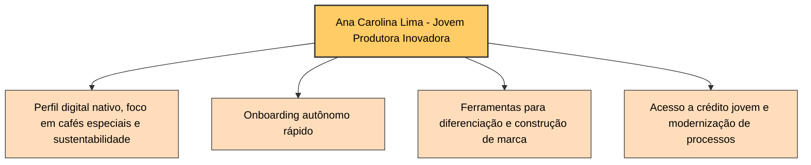

# Diagrama de Função - Persona 3: Ana Carolina Lima - Jovem Produtora Inovadora

## Descrição Detalhada das Funcionalidades e Ferramentas

### 1. Perfil Digital Nativo, Foco em Cafés Especiais e Sustentabilidade

- Interface moderna e responsiva, otimizada para dispositivos móveis e desktop, alinhada ao perfil digital nativo da Ana Carolina.
- Ferramentas para registro detalhado dos lotes de café, incluindo dados de origem, práticas sustentáveis e certificações ambientais.
- Painéis de controle que exibem indicadores de sustentabilidade, qualidade do café e impacto ambiental, facilitando a comunicação transparente com o mercado.
- Integração com sistemas de certificação e rastreabilidade para garantir autenticidade e valor agregado aos cafés especiais.

### 2. Onboarding Autônomo e Intuitivo

- Processo de cadastro simplificado e autônomo, com tutoriais interativos, vídeos explicativos e suporte digital via chatbot.
- Fluxo guiado para configuração inicial da produção, cadastro de lotes e definição de metas de sustentabilidade.
- Ferramentas de autoatendimento que permitem rápida adaptação e uso eficiente da plataforma sem necessidade de suporte presencial.

### 3. Ferramentas para Diferenciação e Construção de Marca

- Módulos para criação e gestão da identidade da marca, com personalização de perfis, materiais digitais e storytelling do produto.
- Recursos para monitoramento da qualidade e rastreabilidade dos cafés especiais, com geração automática de relatórios para compradores e certificadoras.
- Suporte para campanhas digitais e marketing focado em sustentabilidade e inovação, fortalecendo a imagem da produtora no mercado.

### 4. Acesso a Crédito Jovem e Modernização de Processos

- Integração com instituições financeiras que oferecem linhas de crédito específicas para jovens produtores, com simulação e acompanhamento de propostas.
- Módulo de gestão financeira simplificado, que auxilia no planejamento de investimentos prioritários em tecnologias e melhorias produtivas.
- Alertas e notificações sobre oportunidades de crédito, prazos e condições especiais para jovens produtores.
- Fluxo de adoção da plataforma estruturado em etapas claras: cadastro, onboarding, uso das funcionalidades principais e suporte contínuo, garantindo uma experiência fluida e eficiente.

### 5. Investimentos Prioritários e Fluxo de Adoção da Plataforma

- Ferramentas para planejamento estratégico de investimentos, com análises de custo-benefício e retorno esperado.
- Conteúdos educativos e cases de sucesso focados em inovação agrícola e sustentabilidade.
- Suporte para integração com outras ferramentas digitais utilizadas pela produtora, promovendo um ecossistema tecnológico integrado.
- Monitoramento contínuo do progresso e feedback para melhoria da experiência do usuário.

---

Este conjunto de funcionalidades visa proporcionar à Ana Carolina Lima autonomia digital, fortalecimento da sua marca no mercado de cafés especiais, acesso facilitado a crédito jovem e suporte para investimentos sustentáveis e inovadores, alinhando-se ao seu perfil e necessidades específicas.
