# Diagrama de Função - Persona A: Pequena Cooperativa Regional

```mermaid
graph TD
    A[Pequena Cooperativa Regional]
    A --> B[Módulo financeiro em nuvem plug-and-play]
    A --> C[Rastreabilidade com QR-Code + blockchain simplificado]
    A --> D[API climática regional integrada]
    A --> E[Portal web de ofertas spot]
    A --> F[Onboarding assistido e recepção digital]
    A --> G[Alertas climáticos simplificados]
    A --> H[Exportação de relatórios para compradores]

    %% Detalhamento do módulo financeiro
    B --> B1[Dashboard Financeiro]
    B --> B2[Gestão de Receitas]
    B --> B3[Gestão de Despesas]
    B --> B4[Fluxo de Caixa]
    B --> B5[Faturamento e Cobrança]
    B --> B6[Conciliação Bancária]
    B --> B7[Relatórios Financeiros]
    B --> B8[Integração API]
    B --> B9[Segurança e Backup em Nuvem]
    B --> B10[Onboarding Financeiro Assistido]

    %% Fluxos internos simplificados
    B2 --> B4
    B3 --> B4
    B4 --> B1
    B5 --> B2
    B6 --> B1
    B7 --> A
    B8 --> C
    B8 --> E
    B10 --> B1

    %% Detalhamento da API climática regional integrada
    D --> D1[Coleta de Dados Climáticos Regionais]
    D --> D2[Processamento e Análise de Dados]
    D --> D3[API REST para Consulta]
    D --> D4[Alertas Climáticos Personalizados]
    D --> D5[Integração com Módulo Financeiro]
    D --> D6[Dashboard Climático]

    %% Fluxos internos da API climática
    D1 --> D2
    D2 --> D3
    D3 --> D4
    D3 --> D5
    D2 --> D6

    %% Detalhamento da Rastreabilidade com QR-Code + blockchain simplificado
    C --> C1[Geração de QR-Code para Produtos]
    C --> C2[Registro de Transações em Blockchain Simplificado]
    C --> C3[Leitura e Verificação de QR-Code]
    C --> C4[Dashboard de Rastreabilidade]
    C --> C5[Exportação de Relatórios de Rastreabilidade]

    %% Fluxos internos da rastreabilidade
    C1 --> C2
    C2 --> C3
    C2 --> C4
    C4 --> C5

    %% Detalhamento do Portal web de ofertas spot
    E --> E1[Cadastro de Ofertas Spot]
    E --> E2[Consulta e Busca de Ofertas]
    E --> E3[Negociação e Fechamento]
    E --> E4[Notificações de Novas Ofertas]
    E --> E5[Relatórios de Transações]

    %% Fluxos internos do portal de ofertas
    E1 --> E2
    E2 --> E3
    E3 --> E4
    E3 --> E5

    %% Detalhamento dos Alertas climáticos simplificados
    G --> G1[Monitoramento Climático Simplificado]
    G --> G2[Configuração de Alertas Personalizados]
    G --> G3[Envio de Notificações via SMS/Email]
    G --> G4[Dashboard de Alertas]

    %% Fluxos internos dos alertas climáticos
    G1 --> G2
    G2 --> G3
    G3 --> G4

    %% Detalhamento da Exportação de relatórios para compradores
    H --> H1[Dashboard Geral da Aplicação]
    H --> H2[Seleção de Relatórios Personalizados]
    H --> H3[Geração de Relatórios em PDF/Excel]
    H --> H4[Envio Automático para Compradores]
    H --> H5[Histórico de Relatórios Enviados]

    %% Fluxos internos da exportação de relatórios
    H1 --> H2
    H2 --> H3
    H3 --> H4
    H4 --> H5
```

---

## Análise da Persona e Necessidades

A persona é uma **Pequena Cooperativa Regional**, que possui as seguintes funcionalidades no seu ecossistema (extraído do diagrama):

- Módulo financeiro em nuvem plug-and-play
- Rastreabilidade com QR-Code + blockchain simplificado
- API climática regional integrada
- Portal web de ofertas spot
- Onboarding assistido e recepção digital
- Alertas climáticos simplificados
- Exportação de relatórios para compradores

# Descrição Geral

O Módulo financeiro em nuvem plug-and-play é uma solução financeira completa, acessível via web, que permite à pequena cooperativa gerenciar suas finanças de forma simples, segura e integrada. O módulo oferece funcionalidades essenciais para controle de receitas, despesas, fluxo de caixa, faturamento, conciliação bancária e geração de relatórios financeiros, tudo isso com integração facilitada a outros sistemas da cooperativa.

### Funções e Ferramentas do Módulo

| Nome da Função                  | Descrição                                                                                          | Como ajuda a persona                                                                       |
| ------------------------------- | -------------------------------------------------------------------------------------------------- | ------------------------------------------------------------------------------------------ |
| Dashboard Financeiro            | Visão geral em tempo real do status financeiro da cooperativa (saldo, receitas, despesas).         | Permite rápida compreensão da saúde financeira, facilitando decisões ágeis.                |
| Gestão de Receitas              | Registro e acompanhamento das receitas provenientes de vendas e outras fontes.                     | Facilita o controle das entradas financeiras, evitando perdas e erros.                     |
| Gestão de Despesas              | Controle detalhado das despesas operacionais, administrativas e outras.                            | Ajuda a cooperativa a monitorar e otimizar seus gastos.                                    |
| Fluxo de Caixa                  | Monitoramento diário do fluxo de caixa, com previsões e alertas de saldo baixo.                    | Evita surpresas financeiras e permite planejamento financeiro eficiente.                   |
| Faturamento e Cobrança          | Emissão de notas fiscais eletrônicas, boletos e controle de cobranças pendentes.                   | Automatiza processos burocráticos, reduzindo tempo e erros.                                |
| Conciliação Bancária            | Importação e conferência automática dos extratos bancários com lançamentos financeiros.            | Garante a precisão dos registros financeiros e facilita auditorias.                        |
| Relatórios Financeiros          | Geração de relatórios customizáveis (balanço, DRE, fluxo de caixa, etc.) exportáveis em PDF/Excel. | Facilita a prestação de contas e análise detalhada para compradores e gestores.            |
| Integração API                  | APIs para integração com outros módulos (rastreabilidade, portal de ofertas, API climática).       | Permite visão integrada e automatização entre sistemas, aumentando eficiência operacional. |
| Segurança e Backup em Nuvem     | Proteção dos dados financeiros com criptografia e backups automáticos.                             | Garante a segurança e disponibilidade das informações financeiras da cooperativa.          |
| Onboarding Financeiro Assistido | Guia passo a passo para configuração inicial e treinamento básico.                                 | Facilita a adoção do sistema pela equipe da cooperativa, reduzindo barreiras técnicas.     |

### Como ajuda a persona

- Reduz a complexidade da gestão financeira, permitindo que a cooperativa foque em suas atividades principais.
- Aumenta a transparência e controle financeiro, essencial para a confiança entre cooperados e compradores.
- Facilita a integração com outras soluções do ecossistema, ampliando eficiência.
- Permite acesso remoto seguro, importante para equipes distribuídas.
- Automatiza processos burocráticos, economizando tempo e reduzindo erros humanos.

---

### Necessidades implícitas para o módulo financeiro:

- Simplicidade e rapidez na implantação (plug-and-play)
- Gestão financeira integrada e acessível via nuvem, para facilitar o controle financeiro da cooperativa sem necessidade de infraestrutura local
- Automatização de processos financeiros para reduzir erros e retrabalho
- Transparência e rastreabilidade financeira, alinhada com outras funcionalidades como blockchain e rastreabilidade
- Relatórios financeiros claros e exportáveis para tomada de decisão e prestação de contas
- Integração com outras ferramentas do ecossistema, como portal de ofertas e API climática para análises financeiras relacionadas ao clima e mercado

---

## Módulo financeiro em nuvem plug-and-play

### Descrição

Solução financeira completa e acessível via web, que permite à cooperativa gerenciar receitas, despesas, fluxo de caixa, faturamento, conciliação bancária e relatórios financeiros, com segurança e integração facilitada.

### Funções e Ferramentas

- **Dashboard Financeiro**: visão geral em tempo real do status financeiro.
- **Gestão de Receitas**: controle das entradas financeiras.
- **Gestão de Despesas**: controle detalhado dos gastos.
- **Fluxo de Caixa**: monitoramento diário e previsões.
- **Faturamento e Cobrança**: emissão de notas fiscais e boletos.
- **Conciliação Bancária**: conferência automática dos extratos.
- **Relatórios Financeiros**: geração e exportação de relatórios customizáveis.
- **Integração API**: conexão com outros módulos do sistema.
- **Segurança e Backup em Nuvem**: proteção e disponibilidade dos dados.
- **Onboarding Financeiro Assistido**: guia para configuração e treinamento.

| Nome da Função                  | Descrição                                                                                          | Como ajuda a persona                                                                       |
| ------------------------------- | -------------------------------------------------------------------------------------------------- | ------------------------------------------------------------------------------------------ |
| Dashboard Financeiro            | Visão geral em tempo real do status financeiro da cooperativa (saldo, receitas, despesas).         | Permite rápida compreensão da saúde financeira, facilitando decisões ágeis.                |
| Gestão de Receitas              | Registro e acompanhamento das receitas provenientes de vendas e outras fontes.                     | Facilita o controle das entradas financeiras, evitando perdas e erros.                     |
| Gestão de Despesas              | Controle detalhado das despesas operacionais, administrativas e outras.                            | Ajuda a cooperativa a monitorar e otimizar seus gastos.                                    |
| Fluxo de Caixa                  | Monitoramento diário do fluxo de caixa, com previsões e alertas de saldo baixo.                    | Evita surpresas financeiras e permite planejamento financeiro eficiente.                   |
| Faturamento e Cobrança          | Emissão de notas fiscais eletrônicas, boletos e controle de cobranças pendentes.                   | Automatiza processos burocráticos, reduzindo tempo e erros.                                |
| Conciliação Bancária            | Importação e conferência automática dos extratos bancários com lançamentos financeiros.            | Garante a precisão dos registros financeiros e facilita auditorias.                        |
| Relatórios Financeiros          | Geração de relatórios customizáveis (balanço, DRE, fluxo de caixa, etc.) exportáveis em PDF/Excel. | Facilita a prestação de contas e análise detalhada para compradores e gestores.            |
| Integração API                  | APIs para integração com outros módulos (rastreabilidade, portal de ofertas, API climática).       | Permite visão integrada e automatização entre sistemas, aumentando eficiência operacional. |
| Segurança e Backup em Nuvem     | Proteção dos dados financeiros com criptografia e backups automáticos.                             | Garante a segurança e disponibilidade das informações financeiras da cooperativa.          |
| Onboarding Financeiro Assistido | Guia passo a passo para configuração inicial e treinamento básico.                                 | Facilita a adoção do sistema pela equipe da cooperativa, reduzindo barreiras técnicas.     |

### Como ajuda a persona

- Simplifica a gestão financeira, reduzindo complexidade e erros.
- Aumenta transparência e controle para cooperados e compradores.
- Facilita integração com outras soluções, ampliando eficiência.
- Permite acesso remoto seguro, importante para equipes distribuídas.
- Automatiza processos burocráticos, economizando tempo.

---

## API climática regional integrada

### Descrição

A API climática regional integrada é uma solução que coleta, processa e disponibiliza dados climáticos específicos da região da cooperativa. Ela oferece uma interface REST para consulta desses dados, possibilitando a geração de alertas climáticos personalizados e integração com outros módulos do sistema, como o módulo financeiro, para análises financeiras relacionadas ao clima.

### Funções e Ferramentas do Módulo

| Nome da Função                       | Descrição                                                                                        | Como ajuda a persona                                                                 |
| ------------------------------------ | ------------------------------------------------------------------------------------------------ | ------------------------------------------------------------------------------------ |
| Coleta de Dados Climáticos Regionais | Captura dados meteorológicos e ambientais de fontes confiáveis e locais.                         | Fornece informações precisas e atualizadas para a tomada de decisão.                 |
| Processamento e Análise de Dados     | Analisa os dados coletados para identificar padrões, tendências e riscos climáticos.             | Permite antecipar eventos climáticos que podem impactar a produção e finanças.       |
| API REST para Consulta               | Disponibiliza os dados e análises via API REST para consumo por outros sistemas.                 | Facilita a integração e uso dos dados em diferentes plataformas da cooperativa.      |
| Alertas Climáticos Personalizados    | Gera notificações e alertas baseados em condições climáticas específicas e parâmetros definidos. | Ajuda a cooperativa a se preparar para eventos climáticos adversos.                  |
| Integração com Módulo Financeiro     | Permite cruzar dados climáticos com informações financeiras para análises avançadas.             | Auxilia na avaliação de riscos financeiros e planejamento estratégico.               |
| Dashboard Climático                  | Interface visual para monitoramento em tempo real das condições climáticas regionais.            | Facilita o acompanhamento e a tomada de decisões rápidas pela equipe da cooperativa. |

### Como ajuda a persona

- Proporciona dados climáticos regionais precisos e atualizados para melhor planejamento agrícola e financeiro.
- Permite antecipar riscos climáticos, reduzindo perdas e otimizando recursos.
- Facilita a integração com outros módulos, ampliando a visão estratégica da cooperativa.
- Oferece alertas personalizados que aumentam a resiliência da cooperativa frente a eventos climáticos.
- Melhora a tomada de decisão com dashboards intuitivos e dados acessíveis.

---

## Rastreabilidade com QR-Code + blockchain simplificado

### Descrição

Este módulo oferece uma solução para rastrear produtos da cooperativa utilizando QR-Codes vinculados a um blockchain simplificado. Isso garante a autenticidade, transparência e segurança das informações ao longo da cadeia produtiva, facilitando a confiança dos compradores e a gestão interna.

### Funções e Ferramentas do Módulo

| Nome da Função                                    | Descrição                                                                       | Como ajuda a persona                                                                  |
| ------------------------------------------------- | ------------------------------------------------------------------------------- | ------------------------------------------------------------------------------------- |
| Geração de QR-Code para Produtos                  | Criação de QR-Codes únicos para cada lote ou produto.                           | Facilita a identificação e rastreamento dos produtos.                                 |
| Registro de Transações em Blockchain Simplificado | Armazenamento seguro e imutável das transações relacionadas aos produtos.       | Garante a integridade e transparência dos dados de rastreabilidade.                   |
| Leitura e Verificação de QR-Code                  | Ferramenta para leitura dos QR-Codes e validação das informações no blockchain. | Permite verificar a autenticidade e histórico do produto em qualquer ponto da cadeia. |
| Dashboard de Rastreabilidade                      | Interface para monitorar o status e histórico dos produtos rastreados.          | Facilita o acompanhamento e gestão da cadeia produtiva.                               |
| Exportação de Relatórios de Rastreabilidade       | Geração de relatórios detalhados para compradores e auditorias.                 | Melhora a comunicação e prestação de contas com stakeholders.                         |

---

## Portal de Ofertas Spot

### Descrição

O portal web de ofertas spot é uma plataforma online que permite à cooperativa cadastrar, consultar e negociar ofertas de produtos em tempo real. Ele facilita a conexão entre produtores e compradores, promovendo transparência, agilidade e eficiência nas transações comerciais.

### Funções e Ferramentas do Módulo

| Nome da Função                | Descrição                                                     | Como ajuda a persona                                                   |
| ----------------------------- | ------------------------------------------------------------- | ---------------------------------------------------------------------- |
| Cadastro de Ofertas Spot      | Permite registrar ofertas de produtos disponíveis para venda. | Facilita a divulgação rápida e organizada dos produtos da cooperativa. |
| Consulta e Busca de Ofertas   | Ferramenta para buscar ofertas disponíveis no portal.         | Ajuda compradores a encontrar produtos que atendam suas necessidades.  |
| Negociação e Fechamento       | Plataforma para negociação direta e fechamento de negócios.   | Agiliza o processo comercial, reduzindo intermediários.                |
| Notificações de Novas Ofertas | Envio de alertas sobre novas ofertas cadastradas.             | Mantém os interessados informados em tempo real.                       |
| Relatórios de Transações      | Geração de relatórios detalhados das operações realizadas.    | Auxilia no controle e análise das vendas realizadas pela cooperativa.  |

### Como ajuda a persona

- Promove maior visibilidade e alcance das ofertas da cooperativa.
- Facilita a conexão direta entre produtores e compradores.
- Aumenta a eficiência e transparência nas negociações.
- Proporciona controle e análise das transações comerciais.

## Alertas climáticos simplificados

### Descrição

Este módulo oferece um sistema simplificado de monitoramento climático e envio de alertas personalizados para a cooperativa. Ele permite configurar parâmetros específicos para notificações, garantindo que a equipe receba informações relevantes e em tempo hábil para tomada de decisões.

### Funções e Ferramentas do Módulo

| Nome da Função                         | Descrição                                                     | Como ajuda a persona                                             |
| -------------------------------------- | ------------------------------------------------------------- | ---------------------------------------------------------------- |
| Monitoramento Climático Simplificado   | Coleta e análise simplificada de dados climáticos relevantes. | Facilita o acompanhamento das condições climáticas essenciais.   |
| Configuração de Alertas Personalizados | Permite definir critérios para alertas específicos.           | Garante que a cooperativa receba apenas notificações relevantes. |
| Envio de Notificações via SMS/Email    | Sistema automático de envio de alertas para os responsáveis.  | Assegura comunicação rápida e eficaz com a equipe.               |
| Dashboard de Alertas                   | Interface para visualização e gerenciamento dos alertas.      | Facilita o controle e histórico das notificações enviadas.       |

### Como ajuda a persona

- Proporciona informações climáticas relevantes de forma simples e acessível.
- Permite reação rápida a eventos climáticos que possam impactar a produção.
- Reduz o volume de informações desnecessárias com alertas personalizados.
- Melhora a comunicação interna com notificações automáticas.

## Exportação de relatórios para compradores

### Descrição

Este módulo parte do dashboard geral da aplicação, que oferece uma visão consolidada das operações e dados relevantes da cooperativa. A partir desse dashboard, é possível selecionar, gerar e enviar relatórios personalizados para os compradores, facilitando a prestação de contas e a transparência nas transações.

### Funcionalidades do Dashboard Geral

o dashboard geral inclui:

- Visualização de KPIs financeiros, produtivos e de mercado.
- Monitoramento de desempenho da produção e vendas.
- Acesso a análises de mercado e tendências.
- Controle de certificações e compliance.
- Indicadores de sustentabilidade e qualidade.
- Histórico e status das transações comerciais.

### Funções e Ferramentas do Módulo de Exportação

| Nome da Função                       | Descrição                                                   | Como ajuda a persona                                                           |
| ------------------------------------ | ----------------------------------------------------------- | ------------------------------------------------------------------------------ |
| Dashboard Geral da Aplicação         | Visão consolidada e personalizada dos dados da cooperativa. | Facilita o acompanhamento global e a tomada de decisões estratégicas.          |
| Seleção de Relatórios Personalizados | Permite escolher os tipos de relatórios e dados a incluir.  | Garante que os relatórios atendam às necessidades específicas dos compradores. |
| Geração de Relatórios em PDF/Excel   | Cria documentos formatados para fácil leitura e análise.    | Facilita a comunicação e a prestação de contas.                                |
| Envio Automático para Compradores    | Sistema para envio programado ou manual dos relatórios.     | Assegura que os compradores recebam informações atualizadas e confiáveis.      |
| Histórico de Relatórios Enviados     | Registro dos relatórios enviados para controle e auditoria. | Permite rastreamento e verificação das comunicações realizadas.                |

### Como ajuda a persona

- Melhora a transparência e confiança com os compradores.
- Facilita a prestação de contas e comunicação eficiente.
- Permite personalização dos relatórios conforme o perfil do comprador.
- Automatiza processos, economizando tempo e reduzindo erros.
