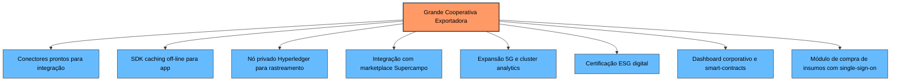

# Diagrama de Função - Persona B: Grande Cooperativa Exportadora

```mermaid
graph TD
    A[Grande Cooperativa Exportadora]
    A --> B[Conectores prontos para integração]
    A --> C[SDK caching off-line para app]
    A --> D[Nó privado Hyperledger para rastreamento]
    A --> E[Integração com marketplace Supercampo]
    A --> F[Expansão 5G e cluster analytics]
    A --> G[Certificação ESG digital]
    A --> H[Dashboard corporativo e smart-contracts]
    A --> I[Módulo de compra de insumos com single-sign-on]

    style A fill:#f96,stroke:#333,stroke-width:2px,color:#000
    style B fill:#6bf,stroke:#333,stroke-width:1px,color:#000
    style C fill:#6bf,stroke:#333,stroke-width:1px,color:#000
    style D fill:#6bf,stroke:#333,stroke-width:1px,color:#000
    style E fill:#6bf,stroke:#333,stroke-width:1px,color:#000
    style F fill:#6bf,stroke:#333,stroke-width:1px,color:#000
    style G fill:#6bf,stroke:#333,stroke-width:1px,color:#000
    style H fill:#6bf,stroke:#333,stroke-width:1px,color:#000
    style I fill:#6bf,stroke:#333,stroke-width:1px,color:#000
```
