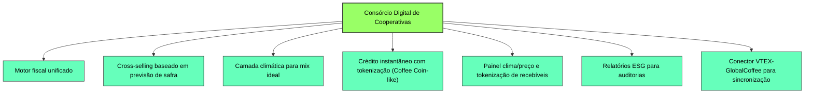

# Diagrama de Função - Persona C: Consórcio Digital de Cooperativas

```mermaid
graph TD
    A["Consórcio Digital de Cooperativas"]
    A --> B["Motor fiscal unificado"]
    A --> C["Cross-selling baseado em previsão de safra"]
    A --> D["Camada climática para mix ideal"]
    A --> E["Crédito instantâneo com tokenização (Coffee Coin-like)"]
    A --> F["Painel clima/preço e tokenização de recebíveis"]
    A --> G["Relatórios ESG para auditorias"]
    A --> H["Conector VTEX-GlobalCoffee para sincronização"]

    style A fill:#9f6,stroke:#333,stroke-width:2px,color:#000
    style B fill:#6fb,stroke:#333,stroke-width:1px,color:#000
    style C fill:#6fb,stroke:#333,stroke-width:1px,color:#000
    style D fill:#6fb,stroke:#333,stroke-width:1px,color:#000
    style E fill:#6fb,stroke:#333,stroke-width:1px,color:#000
    style F fill:#6fb,stroke:#333,stroke-width:1px,color:#000
    style G fill:#6fb,stroke:#333,stroke-width:1px,color:#000
    style H fill:#6fb,stroke:#333,stroke-width:1px,color:#000
```
