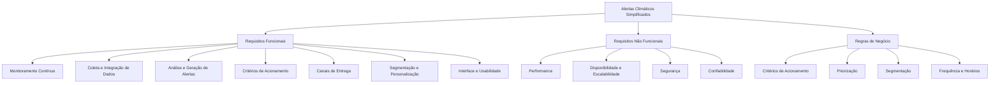
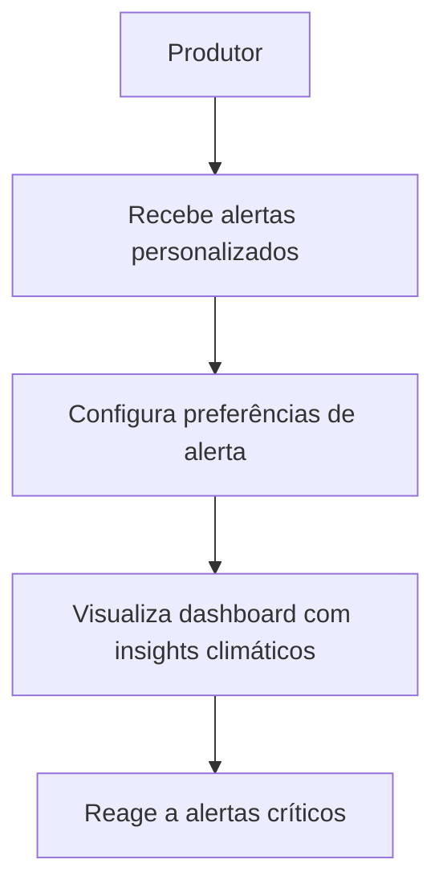
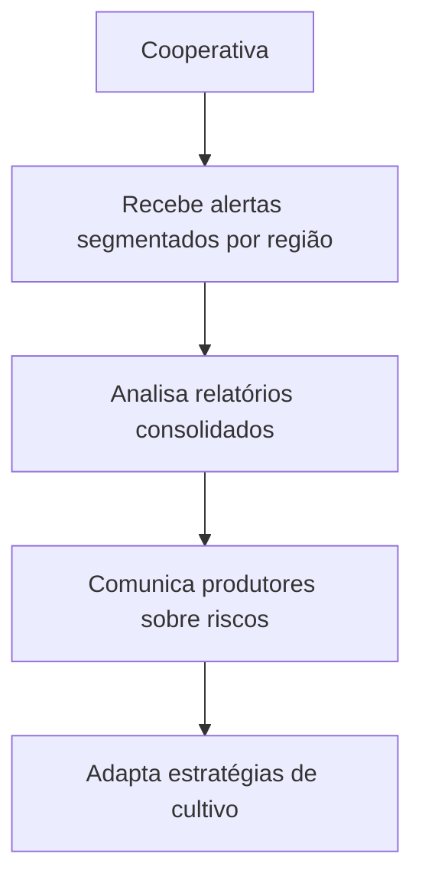
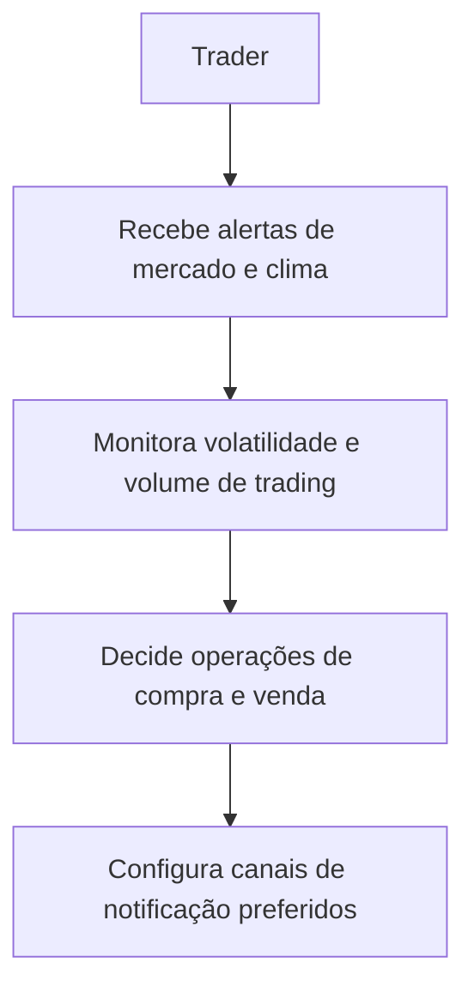

# Documentação Final da Função "Alertas Climáticos Simplificados" - Plataforma Global Coffee

---

## 1. Requisitos Funcionais

### 1.1 Monitoramento Contínuo
- Monitorar dados climáticos, de mercado e notícias relevantes em tempo real.
- Executar análises em ciclos específicos para cobertura global otimizada (06:00, 12:00, 18:00, 00:00 EST).

### 1.2 Coleta e Integração de Dados
- Integrar dados de múltiplas fontes: APIs meteorológicas, bolsas de café, notícias, mídias sociais, dados econômicos e exportação.
- Normalizar, limpar e detectar anomalias nos dados coletados.

### 1.3 Análise e Geração de Alertas
- Analisar dados com modelos de linguagem (LLM) para identificar padrões, correlações e sentimentos.
- Gerar alertas classificados em níveis: Críticos, Altos, Médios e Baixos.
- Priorizar alertas com base em scoring de impacto e relevância.

### 1.4 Critérios de Acionamento
- Acionar alertas para volatilidade de preços, eventos climáticos severos, mudanças significativas no sentimento, volume anômalo de trading e notícias de alto impacto.

### 1.5 Canais de Entrega
- Enviar alertas via Push Notifications (Firebase), SMS (Twilio), WhatsApp Business API e Email (SendGrid/Amazon SES).
- Permitir personalização da entrega por região, tipo de cultivo e perfil do usuário.

### 1.6 Segmentação e Personalização
- Segmentar alertas para perfis: produtores, cooperativas e traders.
- Adaptar conteúdo e formato conforme canal e perfil do destinatário.

### 1.7 Interface e Usabilidade
- Disponibilizar dashboards e relatórios com gráficos e insights.
- Permitir configuração de preferências de alerta pelo usuário.

---

## 2. Requisitos Não Funcionais

### 2.1 Performance
- Latência máxima de 500ms para entrega de alertas.
- Capacidade de processar mais de 1 milhão de eventos por hora.
- Throughput de 10.000 alertas por minuto.

### 2.2 Disponibilidade e Escalabilidade
- Disponibilidade mínima de 99.9% com redundância multi-região.
- Auto-scaling baseado em demanda.

### 2.3 Segurança
- Criptografia AES-256 em repouso e TLS 1.3 em trânsito.
- Compliance com GDPR, incluindo direito ao esquecimento.
- Controle de acesso via RBAC, 2FA para contas premium e IP Whitelisting para APIs corporativas.

### 2.4 Confiabilidade
- Precisão mínima de alertas de 85%.
- Logs de auditoria completos e backup cross-region com RTO < 4h.

---

## 3. Regras de Negócio

### 3.1 Critérios de Acionamento
- Volatilidade de preços: variação > 3% em 1h ou > 5% em 24h.
- Eventos climáticos: alertas meteorológicos para regiões produtoras.
- Sentiment Score: mudança > 20 pontos no índice de sentimento.
- Volume anômalo: volume de trading > 150% da média semanal.
- Notícias de impacto: score > 80 em análise de relevância.

### 3.2 Priorização
- Alertas críticos têm prioridade máxima e resposta em menos de 100ms.
- Alertas são classificados e entregues conforme nível de impacto.

### 3.3 Segmentação
- Alertas são enviados somente para usuários com perfil e região compatíveis.
- Personalização do conteúdo conforme tipo de cultivo e função do usuário.

### 3.4 Frequência e Horários
- Alertas são gerados e enviados em horários otimizados para mercados globais.
- Limitação de taxa de envio para evitar spam e sobrecarga.

---

## 4. Diagramas e Fluxos

### 4.1 Árvore de Requisitos

### 4.2 Fluxos de Usuário

#### Caso de Uso 1: Produtor

#### Caso de Uso 2: Cooperativa

#### Caso de Uso 3: Trader

---

## 5. Sumário Executivo

A função "Alertas Climáticos Simplificados" da plataforma Global Coffee tem como objetivo fornecer monitoramento contínuo e análise integrada de dados climáticos, de mercado e notícias relevantes para os perfis de produtores, cooperativas e traders. A geração de alertas é baseada em critérios rigorosos de acionamento, priorização e segmentação, garantindo que as notificações sejam relevantes e personalizadas.

Os requisitos não funcionais asseguram alta performance, disponibilidade, segurança e confiabilidade, essenciais para a operação em escala global e em tempo real. Os diagramas e fluxos de usuário detalham as interações e processos para cada perfil, facilitando a compreensão e validação dos requisitos.

Este documento serve como base para validação junto aos stakeholders e para orientar o desenvolvimento da função, garantindo alinhamento com as necessidades do negócio e a arquitetura do sistema.
