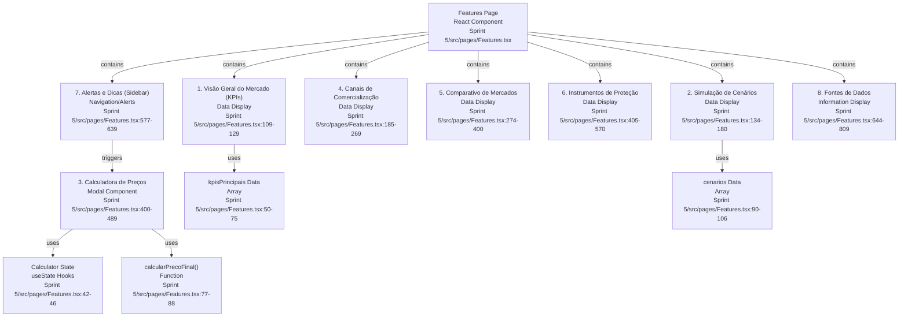
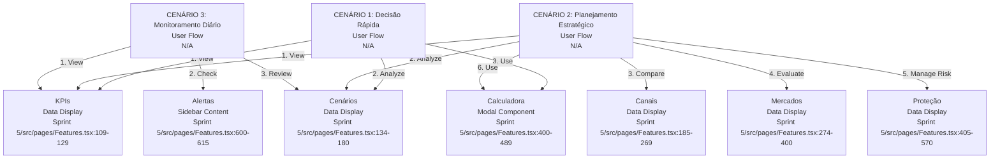
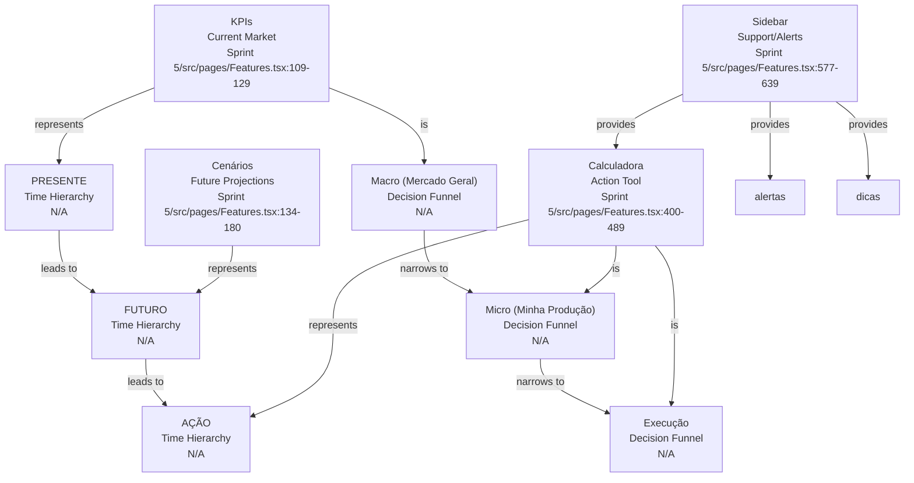
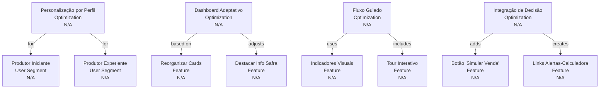

# Codebase Research Report

## Query
ANÁLISE DO FLUXO IDEAL DE LEITURA DA PÁGINA FEATURES.TSX PARA O PRODUTOR DE CAFÉ
================================================================================

CONTEXTO DO USUÁRIO: PRODUTOR DE CAFÉ
--------------------------------------
O produtor de café precisa tomar decisões diárias sobre:
- Quando vender sua produção
- Por qual canal comercializar
- Como se proteger contra variações de preço
- Como maximizar seus lucros

FLUXO DE LEITURA IDEAL (ORDEM DE PRIORIDADE)
=============================================

1. VISÃO GERAL DO MERCADO (KPIs Principais)
   └─> PRIMEIRA PARADA OBRIGATÓRIA
       - Preço Médio Hoje: Referência imediata do mercado
       - Tipo mais Valorizado: Orienta sobre qual qualidade está em alta
       - Melhor Canal: Indica rapidamente a melhor opção de venda
       - Clima Safra: Contexto que afeta toda a produção
   
   RAZÃO: O produtor precisa primeiro entender o "momento do mercado" antes de qualquer decisão.

2. SIMULAÇÃO DE CENÁRIOS (Próximos 30 dias)
   └─> SEGUNDA PARADA CRUCIAL
       - Cenário Otimista (+15%)
       - Cenário Realista (+5%)
       - Cenário Pessimista (-10%)
       - Alerta de Recomendação de Hedge
   
   RAZÃO: Com a visão do presente (KPIs), o produtor agora precisa entender as tendências futuras para decidir se deve vender agora ou esperar.

3. CALCULADORA DE PREÇOS (Modal - Ação Rápida)
   └─> FERRAMENTA DE DECISÃO IMEDIATA
       - Input: Quantidade, Qualidade, Canal, % Hedge
       - Output: Preço final, comissões, valor total
   
   RAZÃO: Se os cenários indicam bom momento, o produtor simula imediatamente quanto receberá por sua produção específica.

4. CANAIS DE COMERCIALIZAÇÃO
   └─> COMPARAÇÃO DETALHADA
       - Via Cooperativa: Segurança, assistência técnica
       - Via Corretor: Flexibilidade, agilidade
       - Análise comparativa de comissões
   
   RAZÃO: Após saber o valor potencial, o produtor analisa COMO vender, comparando vantagens de cada canal.

5. COMPARATIVO DE MERCADOS
   └─> ANÁLISE DE OPORTUNIDADES
       - Mercado Interno vs. Externo
       - Preços por bolsa/mercado
       - Componentes do preço
       - Alerta de oportunidades
   
   RAZÃO: Produtor avalia se deve focar no mercado interno ou buscar exportação.

6. INSTRUMENTOS DE PROTEÇÃO
   └─> GESTÃO DE RISCO
       - Contratos BMF e NY
       - Estratégias disponíveis
       - % de hedge recomendado
   
   RAZÃO: Após decidir vender, o produtor precisa proteger parte da produção futura contra volatilidade.

7. ALERTAS E DICAS (Sidebar)
   └─> MONITORAMENTO CONTÍNUO
       - Alertas de preço atingido
       - Avisos de volatilidade
       - Dicas estratégicas
   
   RAZÃO: Informações complementares para ajustes finos na estratégia.

8. FONTES DE DADOS
   └─> VALIDAÇÃO E CONFIANÇA
       - APIs em tempo real
       - Dados oficiais
       - Métricas de confiabilidade
   
   RAZÃO: Menos prioritário no fluxo diário, mas importante para validar a confiabilidade das informações quando necessário.

PADRÃO DE USO ESPERADO
======================

CENÁRIO 1: DECISÃO RÁPIDA DE VENDA (80% dos casos)
1. KPIs → 2. Cenários → 3. Calculadora → 4. Decisão

CENÁRIO 2: PLANEJAMENTO ESTRATÉGICO (15% dos casos)
1. KPIs → 2. Cenários → 4. Canais → 5. Mercados → 6. Proteção → 3. Calculadora

CENÁRIO 3: MONITORAMENTO DIÁRIO (5% dos casos)
1. KPIs → 7. Alertas → 2. Cenários

INSIGHTS CHAVE
==============

1. HIERARQUIA TEMPORAL: O fluxo segue a lógica PRESENTE → FUTURO → AÇÃO
   - Presente: KPIs atuais
   - Futuro: Cenários projetados
   - Ação: Calculadora e decisão

2. FUNIL DE DECISÃO: Informações gerais → Específicas → Ação
   - Macro (mercado geral) → Micro (minha produção) → Execução

3. REDUNDÂNCIA PROPOSITAL: Informações críticas aparecem em múltiplos pontos
   - Preços aparecem em KPIs, Cenários e Comparativos
   - Hedge aparece em Cenários, Calculadora e Instrumentos
   
4. SIDEBAR COMO SUPORTE: Não é fluxo principal, mas oferece:
   - Atalhos para ações frequentes
   - Lembretes e alertas
   - Validação de decisões

RECOMENDAÇÕES DE OTIMIZAÇÃO
============================

1. PERSONALIZAÇÃO POR PERFIL:
   - Produtor iniciante: Destacar mais as dicas e explicações
   - Produtor experiente: Acesso direto à calculadora e alertas

2. DASHBOARD ADAPTATIVO:
   - Reorganizar cards baseado no uso frequente
   - Destacar informações relevantes para o momento da safra

3. FLUXO GUIADO:
   - Adicionar indicadores visuais (setas, números) sugerindo ordem de leitura
   - Tour interativo para novos usuários

4. INTEGRAÇÃO DE DECISÃO:
   - Botão "Simular Venda" direto nos cards de cenários
   - Link direto de alertas para calculadora

## Answer
# Análise do Fluxo Ideal de Leitura da Página Features para o Produtor de Café

A página **Features** [Features.tsx](Sprint%205/src/pages/Features.tsx) serve como uma central de análise e simulação, projetada para auxiliar o produtor de café na tomada de decisões estratégicas diárias. Ela integra diversas ferramentas e informações, seguindo um fluxo de leitura ideal que prioriza a compreensão do cenário atual, a projeção de tendências futuras e a execução de ações.

## Estrutura da Página e Mapeamento do Fluxo Ideal

A página **Features** [Features.tsx](Sprint%205/src/pages/Features.tsx) é organizada em uma grade principal e uma barra lateral, contendo seções dedicadas a cada etapa do fluxo de decisão do produtor.

### 1. Visão Geral do Mercado (KPIs Principais)
Esta seção é a primeira parada obrigatória, fornecendo uma referência imediata do mercado.
*   **Propósito:** Oferecer uma visão concisa e atualizada dos indicadores chave do mercado de café.
*   **Partes Internas:** Exibe cards individuais para cada KPI, como "Preço Médio Hoje", "Tipo mais Valorizado", "Melhor Canal" e "Clima Safra". Os dados são definidos no array `kpisPrincipais` [kpisPrincipais Data](Sprint%205/src/pages/Features.tsx:50-75) e renderizados em um `SimpleGrid` [KPIs Rendering](Sprint%205/src/pages/Features.tsx:109-129).
*   **Relações Externas:** Utiliza ícones como `FaCoffee`, `FaChartLine`, `FaDollarSign`, `FaArrowTrendUp` para representação visual.

### 2. Simulação de Cenários (Próximos 30 dias)
Após entender o momento atual, o produtor avança para a análise de tendências futuras.
*   **Propósito:** Permitir que o produtor visualize projeções de preço (otimista, realista, pessimista) para os próximos 30 dias.
*   **Partes Internas:** Apresenta cards para cada cenário, com variação de preço, preço estimado e probabilidade. Os dados são definidos no array `cenarios` [Cenários Data](Sprint%205/src/pages/Features.tsx:90-106) e renderizados em um `SimpleGrid` [Cenários Rendering](Sprint%205/src/pages/Features.tsx:134-180). Inclui um `Alert` para recomendação de hedge [Hedge Recommendation Alert](Sprint%205/src/pages/Features.tsx:174-180).
*   **Relações Externas:** Utiliza o ícone `FaChartLine`.

### 3. Calculadora de Preços (Modal - Ação Rápida)
Esta é uma ferramenta de decisão imediata, acessível para simular vendas específicas.
*   **Propósito:** Calcular o preço final, comissões e valor total da produção com base em inputs do produtor.
*   **Partes Internas:** Implementada como um `Modal` [Calculator Modal](Sprint%205/src/pages/Features.tsx:400-489) que é acionado por um botão na barra lateral. Contém `useState` hooks para `quantidade`, `qualidade`, `canal` e `hedge` [Calculator State](Sprint%205/src/pages/Features.tsx:42-46), e a função `calcularPrecoFinal` [Calculation Logic](Sprint%205/src/pages/Features.tsx:77-88) para processar os inputs.
*   **Relações Externas:** O modal é aberto através do botão "Calculadora de Preços" na seção "Ações Rápidas" da barra lateral [Calculator Button](Sprint%205/src/pages/Features.tsx:584-586). Utiliza o ícone `FaCalculator`.

### 4. Canais de Comercialização
Detalha as opções de venda após a simulação de cenários.
*   **Propósito:** Comparar as vantagens e desvantagens de diferentes canais de comercialização.
*   **Partes Internas:** Apresenta cards para "Via Cooperativa" e "Via Corretor", com informações sobre segurança, assistência técnica, agilidade e comissões [Commercialization Channels](Sprint%205/src/pages/Features.tsx:185-269). Inclui um `Alert` para análise dos canais [Channel Analysis Alert](Sprint%205/src/pages/Features.tsx:263-269).
*   **Relações Externas:** Utiliza o ícone `Package`.

### 5. Comparativo de Mercados
Permite ao produtor analisar oportunidades entre mercados.
*   **Propósito:** Avaliar se o foco deve ser no mercado interno ou externo, com detalhes sobre preços e componentes.
*   **Partes Internas:** Contém cards para "Mercado Interno" e "Mercado Externo", uma tabela de "Comparativo de Preços por Mercado" (incluindo BM&F Bovespa, ICE Futures NY, CEPEA/ESALQ, Spot Local), e uma seção de "Componentes do Preço" [Market Comparison](Sprint%205/src/pages/Features.tsx:274-400). Um `Alert` destaca oportunidades [Market Opportunity Alert](Sprint%205/src/pages/Features.tsx:394-400).
*   **Relações Externas:** Utiliza ícones como `TrendingUpIcon`, `FaGlobeAmericas`, `FaCoffee`, `MdTrendingUp`, `MdTrendingDown`, `MdTrendingFlat`, `Clipboard`, `Settings`, `Truck`.

### 6. Instrumentos de Proteção
Foca na gestão de risco para proteger a produção futura.
*   **Propósito:** Informar sobre contratos de hedge e estratégias para proteger a produção contra a volatilidade de preços.
*   **Partes Internas:** Detalha contratos como BMF e NY, o percentual de hedge recomendado, e estratégias de proteção disponíveis (Contratos Futuros, Opções de Venda) [Protection Instruments](Sprint%205/src/pages/Features.tsx:405-570). Inclui um `Alert` com dicas de proteção [Protection Tip Alert](Sprint%205/src/pages/Features.tsx:564-570).
*   **Relações Externas:** Utiliza ícones como `Shield`, `FaChild`, `FaChartLine`.

### 7. Alertas e Dicas (Sidebar)
Esta seção oferece monitoramento contínuo e suporte estratégico.
*   **Propósito:** Fornecer atalhos para ações frequentes, lembretes e alertas importantes, e dicas estratégicas.
*   **Partes Internas:** Contém botões de "Ações Rápidas" (incluindo o que abre a calculadora), "Alertas de Preço" (ex: "Meta atingida!", "Volatilidade alta"), e "Dicas de Mercado" [Sidebar Content](Sprint%205/src/pages/Features.tsx:577-639).
*   **Relações Externas:** Posicionada na barra lateral (`GridItem` com `position="sticky"`).

### 8. Fontes de Dados
Menos prioritária no fluxo diário, mas crucial para validação e confiança.
*   **Propósito:** Detalhar as fontes de dados utilizadas, suas métricas de confiabilidade e disponibilidade.
*   **Partes Internas:** Apresenta informações sobre "APIs em Tempo Real" e "Dados Oficiais", "Disponibilidade por Tipo de Informação" (Preços, Classificação, Clima), e "Métricas de Performance das Fontes" em uma tabela [Data Sources](Sprint%205/src/pages/Features.tsx:644-809). Um `Alert` confirma a integração completa [Integration Complete Alert](Sprint%205/src/pages/Features.tsx:803-809).
*   **Relações Externas:** Utiliza ícones como `BarChart2`, `FaDatabase`, `FaGlobeAmericas`.

## Padrão de Uso Esperado

A estrutura da página **Features** [Features.tsx](Sprint%205/src/pages/Features.tsx) suporta os padrões de uso esperados pelo produtor de café:

*   **CENÁRIO 1: DECISÃO RÁPIDA DE VENDA (80% dos casos)**
    1.  **KPIs** [KPIs Rendering](Sprint%205/src/pages/Features.tsx:109-129)
    2.  **Cenários** [Cenários Rendering](Sprint%205/src/pages/Features.tsx:134-180)
    3.  **Calculadora** [Calculator Modal](Sprint%205/src/pages/Features.tsx:400-489) (acessada via sidebar)
    4.  Decisão

*   **CENÁRIO 2: PLANEJAMENTO ESTRATÉGICO (15% dos casos)**
    1.  **KPIs** [KPIs Rendering](Sprint%205/src/pages/Features.tsx:109-129)
    2.  **Cenários** [Cenários Rendering](Sprint%205/src/pages/Features.tsx:134-180)
    3.  **Canais** [Commercialization Channels](Sprint%205/src/pages/Features.tsx:185-269)
    4.  **Mercados** [Market Comparison](Sprint%205/src/pages/Features.tsx:274-400)
    5.  **Proteção** [Protection Instruments](Sprint%205/src/pages/Features.tsx:405-570)
    6.  **Calculadora** [Calculator Modal](Sprint%205/src/pages/Features.tsx:400-489) (acessada via sidebar)

*   **CENÁRIO 3: MONITORAMENTO DIÁRIO (5% dos casos)**
    1.  **KPIs** [KPIs Rendering](Sprint%205/src/pages/Features.tsx:109-129)
    2.  **Alertas** [Alertas de Preço](Sprint%205/src/pages/Features.tsx:600-615) (na sidebar)
    3.  **Cenários** [Cenários Rendering](Sprint%205/src/pages/Features.tsx:134-180)

## Insights Chave

1.  **Hierarquia Temporal:** O fluxo da página segue a lógica **PRESENTE** (KPIs) → **FUTURO** (Cenários) → **AÇÃO** (Calculadora e decisão), refletindo o processo de tomada de decisão do produtor.
2.  **Funil de Decisão:** A informação transita do macro (mercado geral) para o micro (produção específica do produtor) até a execução, guiando o usuário de forma eficiente.
3.  **Redundância Proposital:** Informações críticas, como preços e hedge, são apresentadas em múltiplos pontos da página (KPIs, Cenários, Comparativos, Instrumentos de Proteção, Calculadora), garantindo que o produtor tenha acesso fácil a dados essenciais.
4.  **Sidebar como Suporte:** A barra lateral [Sidebar Content](Sprint%205/src/pages/Features.tsx:577-639) atua como um centro de apoio, oferecendo atalhos para ações frequentes, lembretes e alertas, e dicas estratégicas, complementando o fluxo principal sem interrompê-lo.

## Recomendações de Otimização

As seguintes recomendações, baseadas na análise do fluxo ideal, podem aprimorar ainda mais a experiência do usuário:

1.  **Personalização por Perfil:**
    *   **Produtor iniciante:** Destacar mais as dicas e explicações, talvez com tooltips ou seções de "Primeiros Passos".
    *   **Produtor experiente:** Oferecer acesso mais direto à calculadora e alertas, talvez com opções de customização do dashboard.
2.  **Dashboard Adaptativo:**
    *   Implementar a reorganização dos cards com base no uso frequente do produtor.
    *   Destacar informações relevantes para o momento da safra, ajustando a visibilidade ou o tamanho dos componentes.
3.  **Fluxo Guiado:**
    *   Adicionar indicadores visuais (setas, números) que sugiram a ordem de leitura ideal, especialmente para novos usuários.
    *   Considerar um tour interativo para apresentar a funcionalidade da página.
4.  **Integração de Decisão:**
    *   Adicionar um botão "Simular Venda" direto nos cards de cenários para uma transição mais fluida para a calculadora.
    *   Criar links diretos de alertas para a calculadora ou outras seções relevantes para ação imediata.

---
*Generated by [CodeViz.ai](https://codeviz.ai) on 25/08/2025, 08:32:57*
